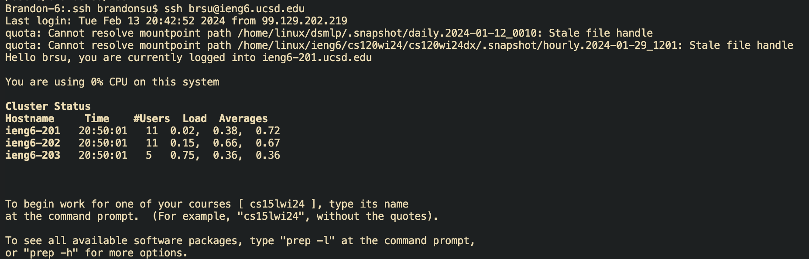

# Report 2
## Part 1
**Code for Chat Server**
```
import java.io.IOException;
import java.net.URI;

class Handler implements URLHandler {
    // The one bit of state on the server: a number that will be manipulated by
    // various requests.
    String[] messages = new String[100];

    public String handleRequest(URI url) {
        if (url.getPath().contains("/add-message")) {
            // Find arguments of user and message
            String[] parameters = url.getQuery().split("&");
            // Obtain string value of user and message
            String message = parameters[0].substring(parameters[0].indexOf("=") + 1);
            String user = parameters[1].substring(parameters[1].indexOf("=") + 1);
            // Concantentating conversation
            String conversation = "";
            
            // Find empty conversation slot
            for(int i = 0; i < messages.length; i++) {
                if(messages[i] == null) {
                    messages[i] = user + ": " + message + "\n";
                    break;
                }
            }
            
            // Concatenate conversation
            for(String lines : messages) {
                if(lines == null) {break;}
                conversation += lines;
            }
            return conversation;
        }
        return "404 Not Found!";
    }
}

class ChatServer {
    public static void main(String[] args) throws IOException {
        if(args.length == 0){
            System.out.println("Missing port number! Try any number between 1024 to 49151");
            return;
        }

        int port = Integer.parseInt(args[0]);

        Server.start(port, new Handler());
    }
}
```
**Add Message 1**

Method | Arguments | Values Updated
| :--- | :--- | :---
Main method | String[] args: Passes port as a string | int port: argument is converted into an int and assigned to port
handleRequest method  | URI url: The url is passed through as a URI object| String[] messages: Within the handleRequest method, the URL is split to obtain the user and the message as seperate variables then concatenates them into single string. Then handleRequest finds the next empty index in the array and adds the new string with the concatentated message into the array then loops through the array and prints every string within the array which is the only string which has been added.

**Add message 2**

Method | Arguments | Values Updated
| :--- | :--- | :---
Main method | String[] args: Passes port as a string | int port: argument is converted into an int and assigned to port
handleRequest method  | URI url: The url is passed through as a URI object| String[] messages: Within the handleRequest method, the URL is split to obtain the user and the message as seperate variables then concatenates them into single string. Then handleRequest finds the next empty index in the array and adds the new string with the concatentated message into the array then loops through the array and prints every string within the array which includes the preivous messages.

## Part 2
**Private Key**
Absolute path: `/home/linux/ieng6/oce/59/brsu/.ssh/authorized_keys`


**Public Key**
Absolute path: `/Users/brandonsu/.ssh/id_rsa.pub`


**Login without password**

