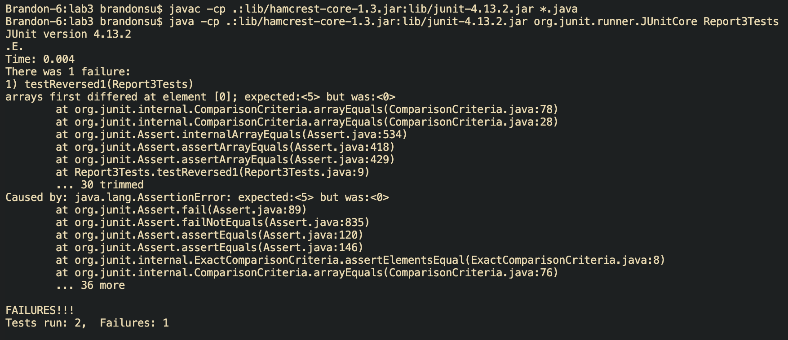

# Lab 3
## Part 1
**Failure Inducing Output**
```
@Test
public void testReversed1() {
    int[] integers = new int[]{1, 2, 3, 4, 5};
    int[] expectedArr = new int[]{5, 4, 3, 2, 1};
    assertArrayEquals(expectedArr, reversed(integers));
}
```
**Non-failure Inducing Output**
```
@Test
public void testReversed2() {
    int[] integers = new int[]{0};
    int[] expectedArr = new int[]{0};
    assertArrayEquals(expectedArr, reversed(integers));
}
```
**Symptom of Tests**

**Before-and-After Code Changes**
Before
```
  static int[] reversed(int[] arr) {
    int[] newArray = new int[arr.length];
    for(int i = 0; i < arr.length; i += 1) {
      arr[i] = newArray[arr.length - i - 1];
    }
    return arr;
  }
```
After
```
  static int[] reversed(int[] arr) {
    int[] newArray = new int[arr.length];
    for(int i = 0; i < arr.length; i += 1) {
      newArray[i] = arr[arr.length - i - 1];
    }
    return newArray;
  }
```
