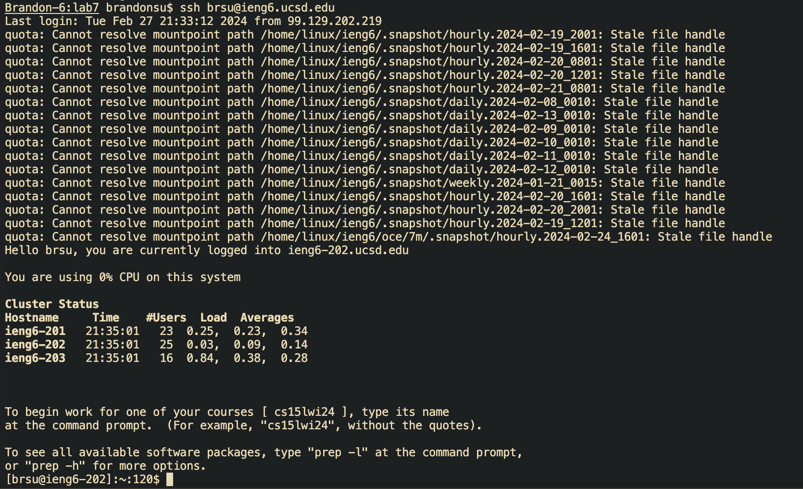
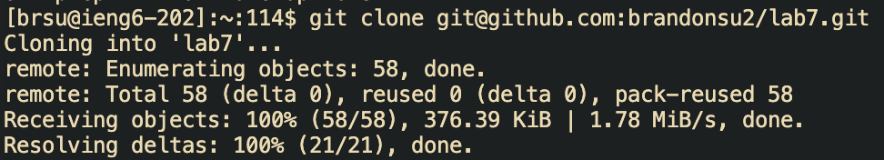
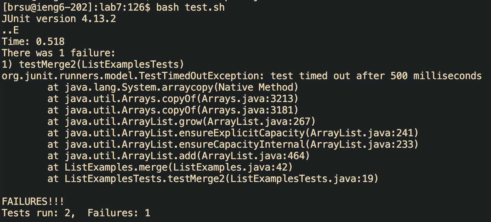
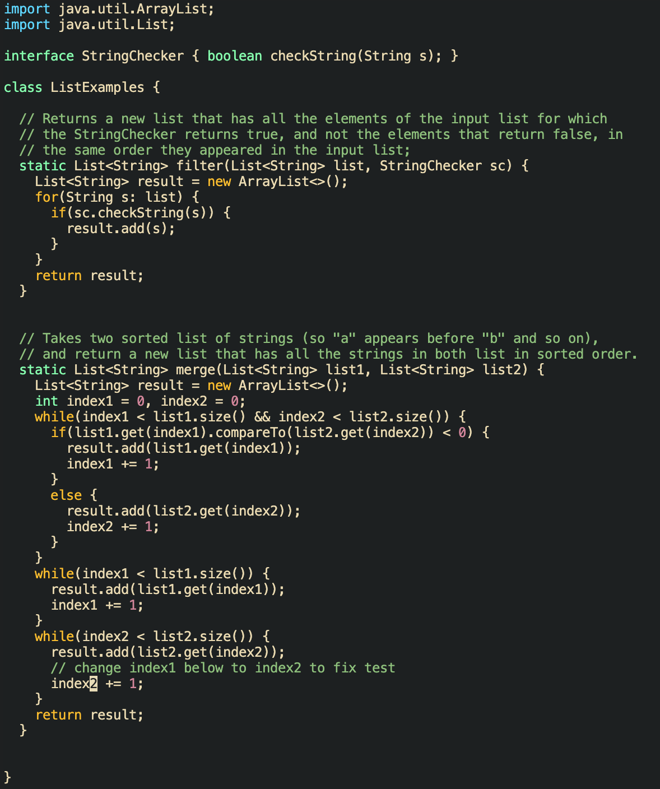
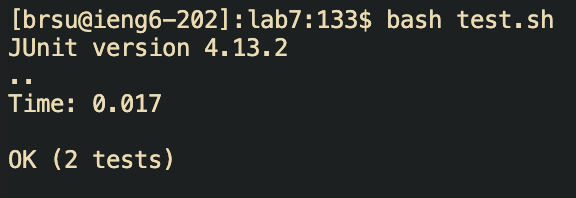
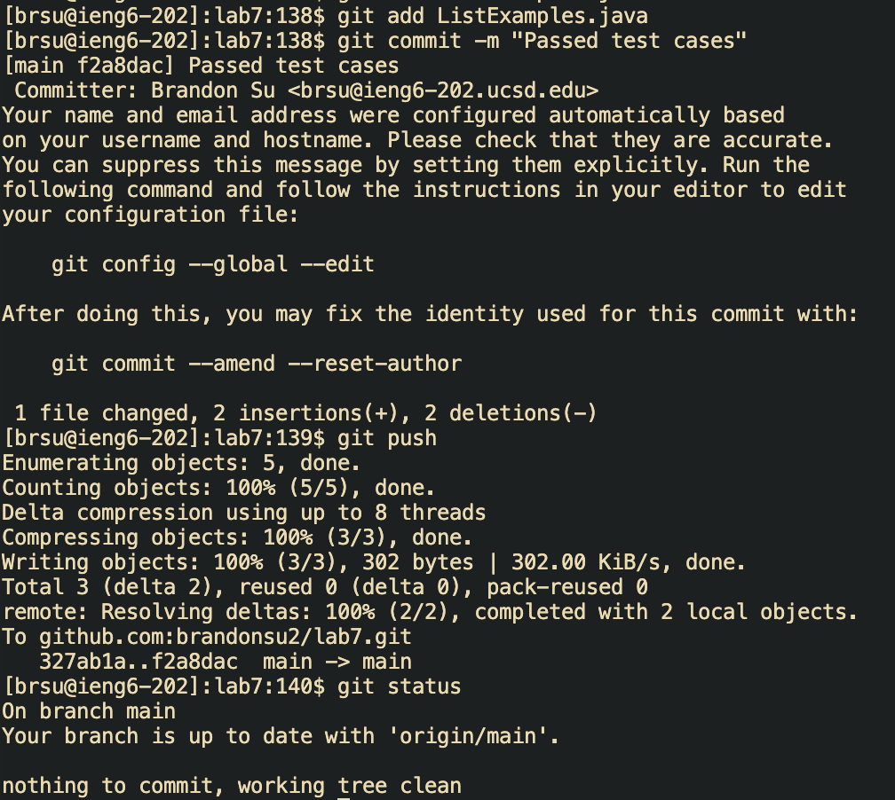

# Report 4
## Step 4
Keys pressed: `<up><enter>`. Because I logged in very recently to the server, I only had to press the two keys to log into the server.

## Step 5
Keys pressed: `git clone git@github.com:brandonsu2/lab7.git`. In order clone the forked repo, I used git clone to clone a repo and used the ssh url `git@github.com:brandonsu2/lab7.git` which I am able to use because I connected a ssh key between the ieng6 computer and my GitHub account. 

## Step 6
Keys pressed: `(cd lab7)(bash test.sh)`. In order to compile and run the `ListExamplesTests.java` file, I had to first change my working directory to direction `lab7` using the `cd` command. Once my working directory was updated, I typed in "bash test.sh" in order to compile and run test file resulting in 2 tests running and 1 test failing.

## Step 7
Keys pressed: `(vim List<tab>.<tab>)14j5w3x30jk3ger2:wq`. In order to fix the error in the `ListExamples.java` file, I opened the file using Vim with the command `vim List<tab>.<tab>`. Once I was in the file, I needed to fix two problem. First, I had to change the adding of string `s` to the List `result` by changing it so each string `s` was appended instead of inserted at index 0. I accomplised this by traversing to location of the error using `14j5w` and deleting the argument which prepended `s` using `3x`. Then I had to change the incrementation within a while loop so I navigated to the problem using `30jk3ge` then had to replace the character 1 with 2 which I accomplised using `r2`. Once I finished editting, I wrote to the file and quit using `:wq`.

## Step 8
Keys pressed: `<up><up><enter>`. In order to run the tests again, I used the up arrow to navigate up 2 place up is the history as I have recently run the test script. Once I found the command to run the script, I pressed enter which reran the test and showed the tests passed.

## Step 9
Keys pressed: `(git add Li<tab>.j<tab>)(git commit -m "Passed test cases")(git push)`. To commit and push my changes to GitHub, I first had to stage the file I changed which I did my using `git add` and the file name `ListExamples.java`. Once staged, I commited using `git commit -m` with my message that the updated file passes the test methods. Once I commited, I pushed my changes to the main branch by using `git push`.

