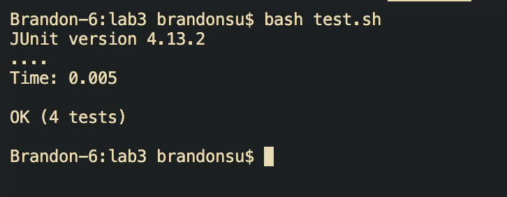

# Report 5
## Part 1
**The Student Post**

I'm having trouble getting my ArrayExamples class to pass a test case I wrote. I'm not too sure if my test case is wrong or my averageWithoutLowest function is wrong, but I'm leaning towards my function. When passing the double array {1, 1, 5, 6, 7}, I expect the average to be 6.0 as 1 is the minimum value of the array and should be excluded but my actual value is 9.0. This number doesn't make sense as I create a new variable to account for the number of times lowest appears and remove it from the average calculation. Thank you for your help.

Error output:

Test method:

My averageWithoutLowest method:

My testing bash script in case I am running the wrong commands:

---
**The TA Response**

Good job in trying to eliminate multiple elements that share the value of lowest, but are we counting the number of matching elements correctly? Try tracing through the iterations when adding to the numLowest counter and make sure we are incrementing in the correct cases. 

---
**The Bug Fix**

I looked back at my implementation of averageWithoutLowest and traced through the iterations. We loop through array values {1, 1, 5, 6, 7}. Then I noticed that my incrementation of numLowest only increments when we are adding to the sum, which is incorrect as we should be incrementing when we are not adding to sum i.e. when num == lowest. So I created an else statment to my if statment num != lowest, meaning if num does not satisfiy num != lowest, then num == lowest and we should increment numLowest. Once I fixed where my code was incrementing and ran my bash script, which compiled and ran my test cases, all my tests passed.

Fixed method:

Test cases passed:

---
**Setup**

In order for the file setup to work, we need 3 files within the same working directory, `ArrayExamples.java`, `ArrayTests.java`, and `test.sh`. For the contents of each file, `ArrayExamples.java` needs to have the default implementation of `averageWithoutLowest` which is retrieved from lab 4 repository of cse15l, with the inclusion of a counter variable `numLowest` which is the student's attempt at fixing the buggy method and removing the lowest number from the average calculation. For contents of `ArrayTests.java`, we need a test case which passes an array with multiple matches to the lowest value in the array as the student's initial implementation does not work when there are differing number of nonmatches and matches to the lowest element. For the contents of the bash script `test.sh`, we need the commands `javac -cp .:lib/hamcrest-core-1.3.jar:lib/junit-4.13.2.jar *.java` and `java -cp .:lib/hamcrest-core-1.3.jar:lib/junit-4.13.2.jar org.junit.runner.JUnitCore ArrayTests` within the script to compile all java files in the working directory and run the ArrayTests.class file. In order to trigger the bug, we run the bash script using `bash test.sh` and run and compile the test class which results in a failing test case which we wrote. In order to fix the bug, we need to seperate the case where we increment `numLowest` and when we add `num` to `sum` by only adding to `sum` when the number does not match `lowest` and incrementing when `num` matches `lowest`.

## Part 2
I've learned so much in this class, more so in the second half of the quarter as we began to dive into more technical aspects of debugging and using the command line to accelerate workflow. I specifically found writing bash scripts very time-efficient as I often found myself at the beginning of the quarter copy-pasting commands into the terminal in order to compile and run JUnit tests and also being confused when handling error codes. I began writing bash scripts for other classes that I code in this quarter such as CSE 12 and MATH 183 which saved me lots of time and made my workflow much smoother. I definitely plan on continuing to use scripts in future coding experiences. I also really liked the introduction to Vim as I have heard about how people do not use IDEs to code and instead only use Vim which interested me. Finally being in a class where vim is taught opened my eyes to the possibility of exclusively using a keyboard to navigate my coding environment. I definitely need more practice but I thoroughly appreciate this class providing the tools I need to work towards that goal. I also found the JDB debugging environment intuitive and useful in stepping through my code, as I recall using the VScode extension debugger for Python which functionally was very similar to JDB but used the VScode UI in order to create breakpoints and step-through code which is neat. Overall, I'm glad this class was mandatory for my major as I definitely see myself applying these tools outside of this class and in the future, and hope CSE 29 retains most if not all of the topics in the class for future students.
