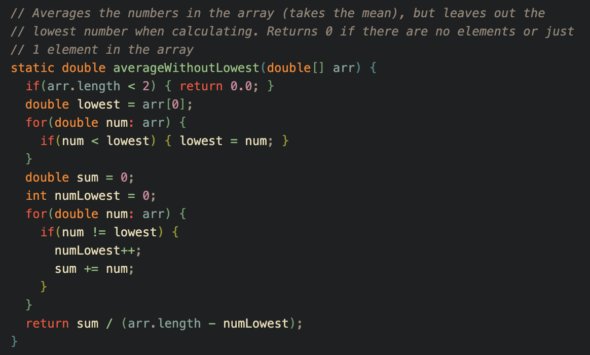

# Report 5
## Part 1
**The Student Post**

I'm having trouble getting my ArrayExamples class to pass a test care I wrote. I'm not too sure if my test case is wrong or my averageWithoutLowest function is wrong, but I'm leaning towards my function. When passing the double array {1, 1, 5, 6, 7}, I expect the average to be 6.0 as 1 is the minimum value of the array and should be excluded but my actual value is 9.0. This number doesn't make sense as I create a new variable to account for the number of times lowest appears and remove it from the average calculation. Thank you for your help.
Error output:

Test method:

My averageWithoutLowest method:

My testing bash script in case I am running the wrong commands:

---
**The TA Response**

Good job in trying eliminate multiple elements that share the value of lowest, but are we counting the number of matching elements correctly? Try tracing through the iterations when adding to the numLowest counter and make sure we are incrementing in the correct cases. 

---
**The Bug Fix**

I looked back at my implementation of averageWithoutLowest and traced through the iterations. We loop through array values {1, 1, 5, 6, 7}. Then I noticed that my incrementation of numLowest only increments when we are adding to the sum, which is incorrect as we should be incrementing when we are not adding to sum i.e. when num == lowest. So I created an else statment to my if statment num != lowest, meaning if num does not satisfiy num != lowest, then num == lowest and we should increment numLowest. Once I fixed where my code was incrementing and ran my bash script, which compiled and ran my test cases, all my tests passed.
Fixed method:

Test cases passed:

